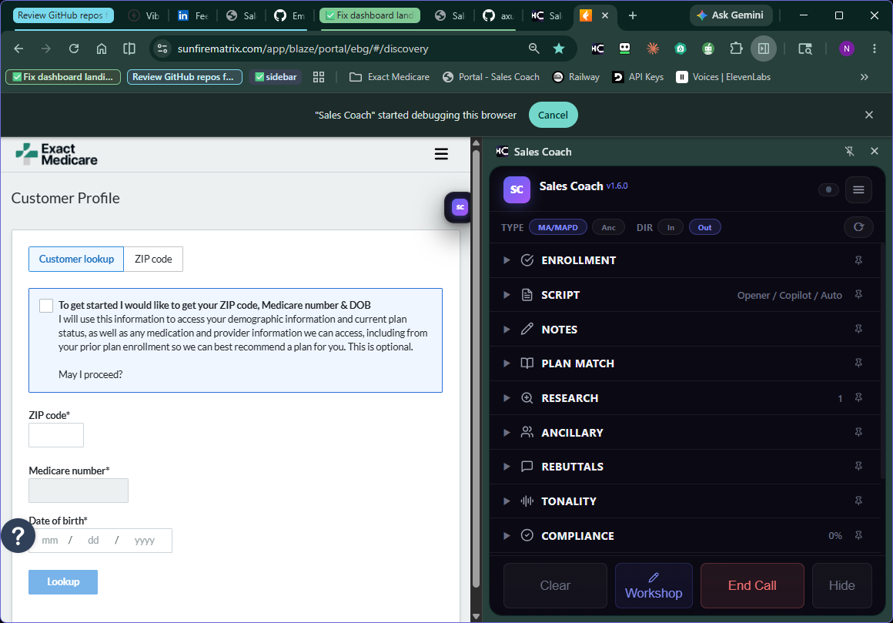
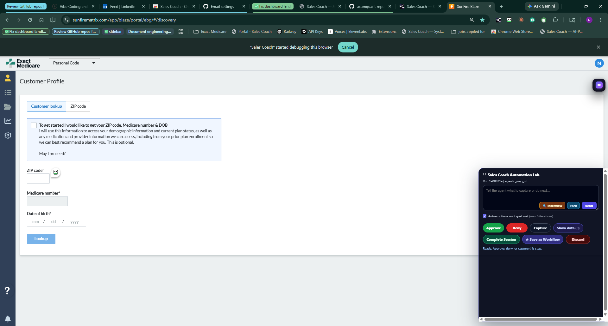
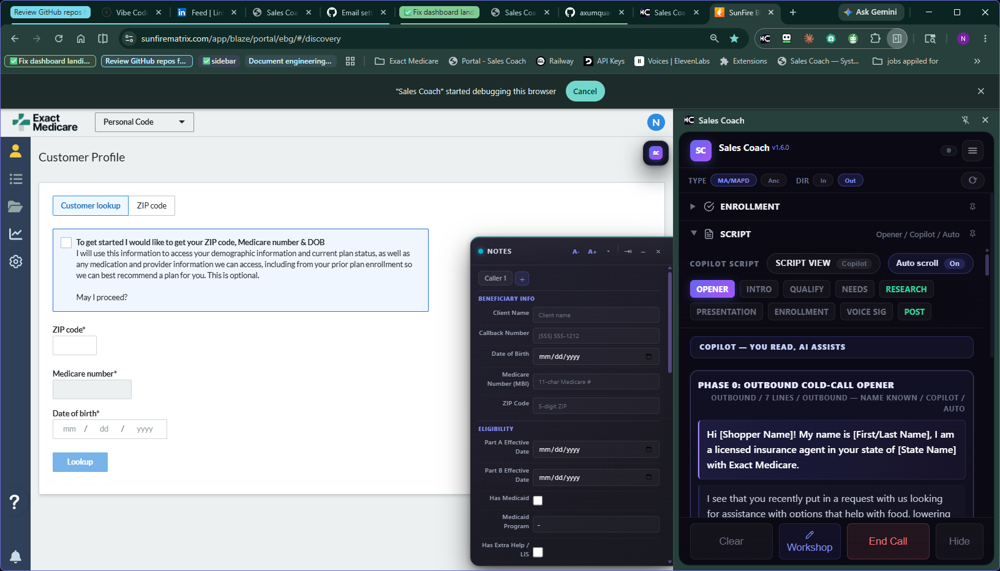
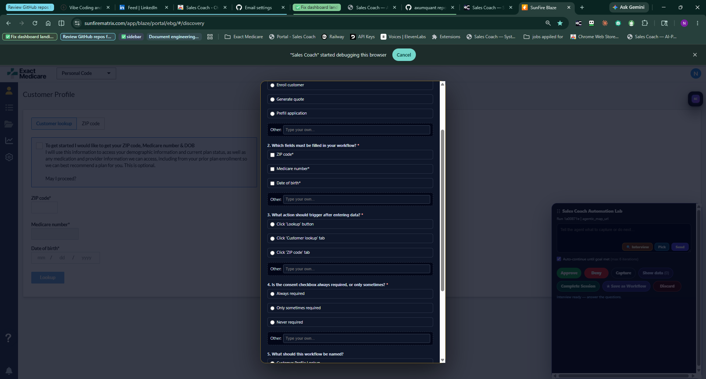
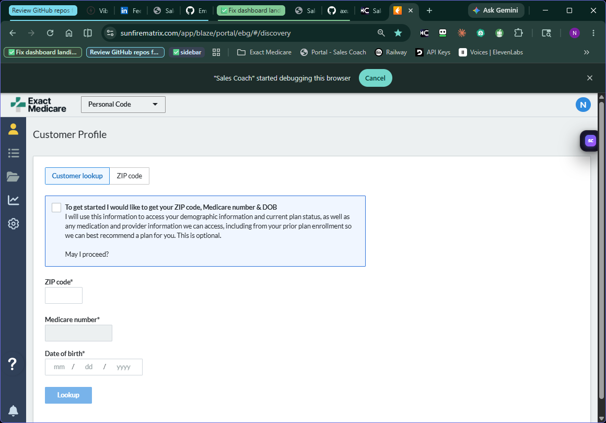

# Axum Labs

> Agentic AI lab building autonomous systems for fintech and real-time B2B sales operations.

We design and ship multi-agent AI infrastructure where it matters most: production trading systems that compound capital, and live sales workflows that compound revenue. Original work, shipped end-to-end.

---

## Products

### Sales Coach
Real-time AI coaching platform for B2B insurance sales. 12 specialized agents deliver sub-800ms coaching cues during live calls — compliance alerts, objection handling, plan matching, and tonality feedback. Self-healing portal integration via three-layer extraction (CDP network interception → accessibility tree → vision-language model fallback).

- **Landing page:** [portal-three-rose.vercel.app](https://portal-three-rose.vercel.app)
- **Chrome extension:** [Chrome Web Store →](https://chromewebstore.google.com/detail/sales-coach/oeleifakfnkihkkbeaabgibdoeknnilp)
- Source: proprietary — commercial product

#### Live shots from a real Medicare enrollment session

**Full coaching sidepanel** — Sales Coach v1.6.0 docked next to SunFire's Medicare enrollment portal. Nine specialized cards (Enrollment, Script, Notes, Plan Match, Research, Ancillary, Rebuttals, Tonality, Compliance) update in real time during the call.

<table>
  <tr>
    <td width="50%"></td>
    <td width="50%"></td>
  </tr>
  <tr>
    <td align="center"><b>Automation Lab</b> — agent-driven actions on a live carrier portal. Interview, Pick, Send, Approve, Deny, Capture, Save as Workflow.</td>
    <td align="center"><b>Live script</b> with phase tracking. Opener → Problem → Presentation → Agitation → Quality. Verbatim opener rendered for the agent to read.</td>
  </tr>
  <tr>
    <td width="50%"></td>
    <td width="50%"></td>
  </tr>
  <tr>
    <td align="center"><b>Interview Mode</b> — agent-led multi-choice prompts replace freeform instructions. The agent asks structured questions to configure each new portal workflow.</td>
    <td align="center"><b>Carrier portal integration</b> — the <code>"Sales Coach" started debugging this browser</code> banner confirms live CDP-level network interception on the Medicare enrollment portal.</td>
  </tr>
</table>

### Axum Labs Trading Platform
Autonomous quantitative trading infrastructure. Full Rust + Python stack with multi-agent strategy evolution, alternative-data pipelines (satellite imagery, AIS shipping, regime / sentiment classification), and Nomad-orchestrated deployment. 30+ MCP servers and 15+ specialized agents.

- Source: proprietary — commercial product

### Axum Labs Studio
Autonomous AI web agency platform. A coordinated agent swarm takes a client brief and delivers a deployed, monitored website end-to-end. Intake agent extracts brand guidelines, browser operator generates designs via headless Playwright, copywriter QA enforces tone, debug engineer validates in sandbox, and MCP deployer ships to Shopify or Wix through a Rust gateway. Four-tiered memory (Postgres, Redis, Mem0/Qdrant, Neo4j) ensures agents learn from every engagement.

- Source: proprietary — commercial product

---

## Open-Source Infrastructure

The reusable building blocks underneath the products above. All original work, all production-tested.

| Repo | What it is |
|---|---|
| [**site-mapper-agents**](https://github.com/axumquant/site-mapper-agents) | LLM-driven self-healing API discovery — Pydantic AI agents (Architect, Eavesdropper, Healer) adapt to schema changes |
| [**arch-viewer**](https://github.com/axumquant/arch-viewer) | MCP-native codebase analysis — interactive architecture diagrams, Neo4j knowledge graph, 17 Claude Code tools |
| [**cdp-network-interceptor**](https://github.com/axumquant/cdp-network-interceptor) | Chrome DevTools Protocol network capture for MV3 extensions — PII redaction, iframe auto-attach, stale-debugger recovery |
| [**mv3-audio-replay-buffer**](https://github.com/axumquant/mv3-audio-replay-buffer) | Encrypted, durable audio frame buffer for Chrome MV3 service workers — ack-based replay over WebSocket |
| [**devkit**](https://github.com/axumquant/devkit) | Universal B2B/SaaS development foundation — skills, hooks, agents, CI/CD templates |

---

## Stack

**Languages** — Python · Rust · TypeScript · Shell

**AI / Agents** — Multi-agent orchestration · MCP servers · LLM routing (Ollama Cloud, OpenAI, Anthropic) · RAG (Qdrant, Neo4j)

**Backend** — FastAPI · async WebSockets · Supabase Postgres · Redis · ClickHouse · Stripe

**Browser** — Chrome MV3 · CDP network interception · accessibility-tree crawling · VLM fallback

**Frontend** — Next.js 15 · Tauri 2 · responsive sidepanel UIs

**Infra** — Nomad · Railway · Cloudflare · Docker · CI/CD automation

---

## Contact

Norman Beckford — Licensed Medicare Agent who taught himself to build the software his industry wouldn't. Started learning to code in 2018, building on LLMs since 2022.

- norman@axumquant.com
- [linkedin.com/in/norman-beckford-832711218](https://linkedin.com/in/norman-beckford-832711218)
