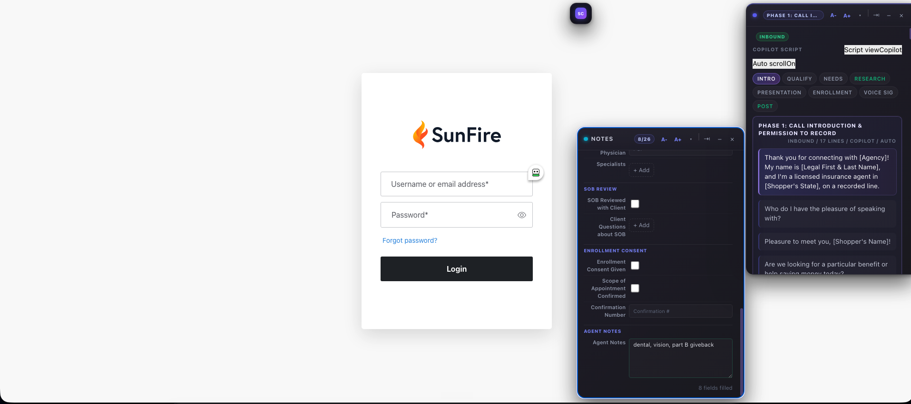
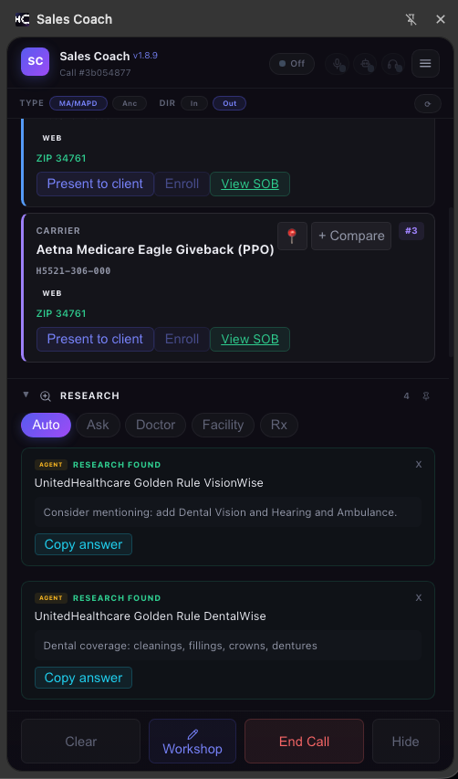
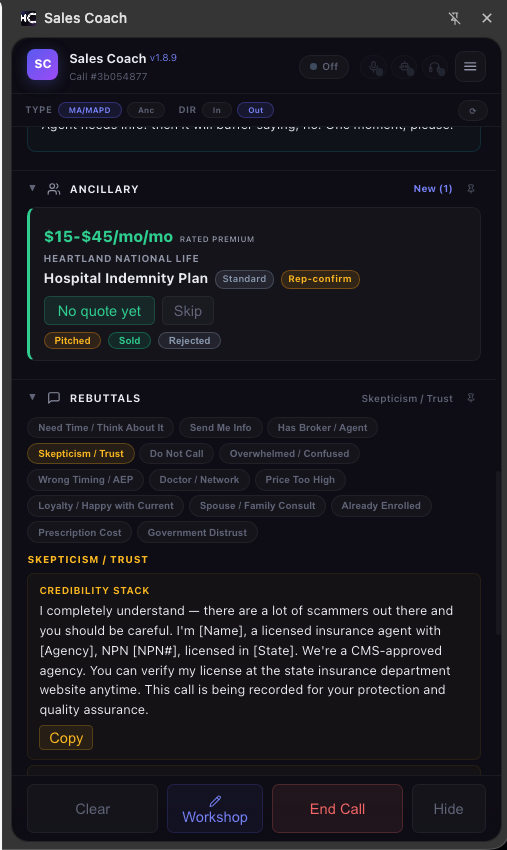
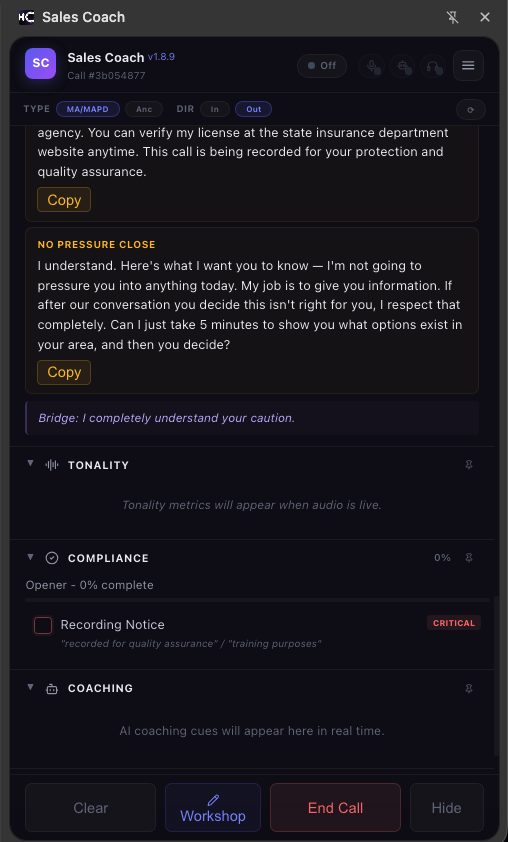
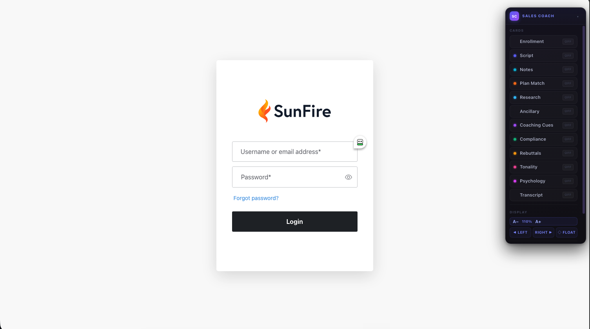
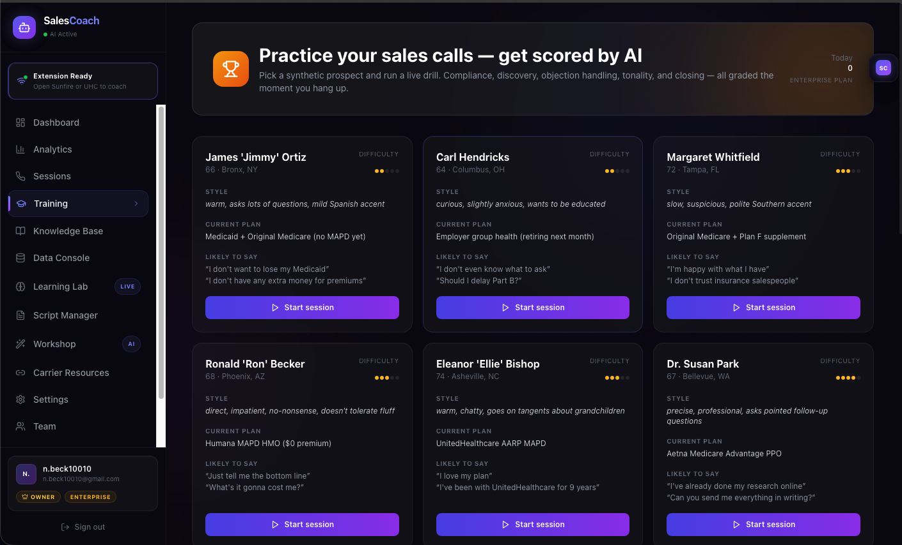
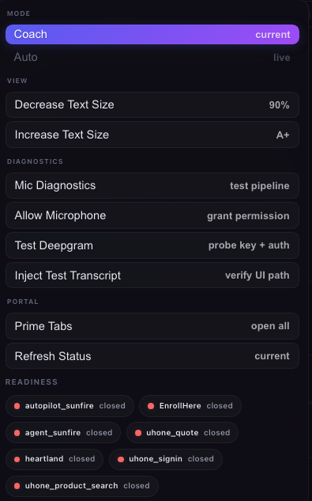

# Axum Labs

### Agentic AI lab building autonomous systems for fintech &amp; real-time B2B sales

**[Products](#products)** · **[Architecture Overviews](#public-architecture-overviews)** · **[Open Source](#open-source-infrastructure)** · **[Stack](#stack)** · **[Contact](#contact)**

---

We design and ship multi-agent AI infrastructure where it matters most: **production trading systems that compound capital, and live sales workflows that compound revenue.** Original work, shipped end-to-end — Rust + Python, from compute kernels to browser extensions.

---

## Products

### Sales Coach
Real-time AI coaching platform for B2B insurance sales. **13 specialized agents** deliver live coaching cues — compliance & SOA disclosure tracking, objection handling, plan matching, research, and tonality feedback — under a **sub-800ms end-to-end latency budget**. Self-healing carrier-portal integration: a three-layer perception stack (**CDP network interception → DOM/selector mapping → vision-language-model fallback**) plus an event-driven healer that auto-repairs when carrier APIs change. Real-time voice runs through a Rust (axum + tokio) WebSocket service streaming to Deepgram, with PII/PHI redaction in-Rust.

- **Live:** [salescoach.axumquant.com](https://salescoach.axumquant.com)
- **Chrome extension:** [Chrome Web Store →](https://chromewebstore.google.com/detail/sales-coach/oeleifakfnkihkkbeaabgibdoeknnilp)
- **Status:** Public beta (v1.9.7), validating with early-access agencies
- Source: proprietary — commercial product

#### Live shots from a Medicare enrollment session

<b>The coaching panel in action</b> — Sales Coach docked beside SunFire's Medicare enrollment portal. The live script tracks call phases (Intro → Qualify → Needs → Research → Presentation → Enrollment), while call notes and permission-to-record prompts update in real time.

<table>
  <tr>
    <td width="50%"></td>
    <td width="50%"></td>
  </tr>
  <tr>
    <td align="center"><b>Plan Match + AI Research</b> — ranked carrier plans with one-click SOB, and an agent that surfaces supplemental coverage (Vision, Dental, Hearing) mid-call.</td>
    <td align="center"><b>Ancillary + Rebuttals</b> — cross-sell prompts and real-time objection handling, from a credibility stack to no-pressure-close scripts.</td>
  </tr>
  <tr>
    <td width="50%"></td>
    <td width="50%"></td>
  </tr>
  <tr>
    <td align="center"><b>Compliance + Tonality + Coaching</b> — recording-notice & disclosure tracking, live tonality metrics, and coaching cues delivered as the call unfolds.</td>
    <td align="center"><b>Modular card system</b> — each specialist agent renders as a card the rep toggles on demand: Enrollment, Script, Notes, Plan Match, Research, Ancillary, Coaching, Compliance, Rebuttals, Tonality, Psychology, Transcript.</td>
  </tr>
  <tr>
    <td width="50%"></td>
    <td width="50%"></td>
  </tr>
  <tr>
    <td align="center"><b>AI roleplay training</b> — reps practice against AI personas and get scored on discovery, objection handling, compliance, and tonality before they ever touch a live call.</td>
    <td align="center"><b>Built-in diagnostics</b> — Deepgram STT health checks and multi-carrier portal readiness (SunFire, EnrollHere, Heartland, UHOne…).</td>
  </tr>
</table>

### Axum Labs Trading Platform
Autonomous quantitative trading infrastructure. Rust + Python: **Rust compute kernels** (PyO3/maturin), **island-model evolutionary strategy discovery**, and a **9-stage statistical validation gauntlet** (walk-forward, Deflated Sharpe, CPCV, Monte-Carlo) that rejects overfit strategies before any capital is risked. **30+ strategy archetypes**, 20+ specialized agents, 30+ MCP servers, and 80+ Nomad jobs; alternative-data pipelines (satellite imagery, AIS shipping, sentiment / regime classification).

- **Architecture overview:** [github.com/axumquant/axum-trading-platform](https://github.com/axumquant/axum-trading-platform)
- Source: proprietary — commercial product

### Axum Labs Studio
Autonomous AI web agency platform. A coordinated agent swarm takes a client brief and delivers a deployed, monitored website end-to-end. Intake agent extracts brand guidelines, browser operator generates designs via headless Playwright, copywriter QA enforces tone, debug engineer validates in sandbox, and an MCP deployer ships to Shopify or Wix through a Rust gateway. Four-tiered memory (Postgres, Redis, Mem0/Qdrant, Neo4j) lets agents learn from every engagement.

- **Architecture overview:** [github.com/axumquant/axum-labs-studio-overview](https://github.com/axumquant/axum-labs-studio-overview)
- Source: proprietary — commercial product

### Public Architecture Overviews
Deep architecture write-ups for the proprietary products above — no source, full design.

| Repo | What's inside |
|---|---|
| [**axum-trading-platform**](https://github.com/axumquant/axum-trading-platform) | Hero README + architecture diagram + `docs/ARCHITECTURE.md` — discovery loop, 9-stage validation gauntlet, agent separation-of-powers |
| [**axum-labs-studio-overview**](https://github.com/axumquant/axum-labs-studio-overview) | README + Engineering Highlights — agent swarm, Rust MCP gateway (Universal Commerce Protocol), four-tier shared memory |

---

## Open-Source Infrastructure

The reusable building blocks **extracted from the products above** — all original work, production-tested, each with real browsable source (not just a README).

| Repo | What it is |
|---|---|
| [**site-mapper-agents**](https://github.com/axumquant/site-mapper-agents) | LLM-*once* API discovery for any browser-accessible portal. Burst-record CDP traffic while you click; a three-agent team (Architect · Eavesdropper · Healer) returns a typed `SiteSchema` + signatures. Extraction is then pure sub-millisecond Pydantic matching — and self-heals when the portal's API shape drifts. |
| [**agentic-browser-lab**](https://github.com/axumquant/agentic-browser-lab) | Multi-agent browser automation inside a Chrome MV3 extension — no Playwright, no Selenium. Perceiver + Planner + Interviewer agents drive the user's *real logged-in* session and interview the user to configure each new workflow. |
| [**learned-workflows-marketplace**](https://github.com/axumquant/learned-workflows-marketplace) | "GitHub for AI workflows" — record a browser workflow once, auto-template typed PII into params, store across Postgres (truth) + Qdrant (semantic search) + Neo4j (relationships), version every edit, and opt-in share across tenants. |
| [**cdp-network-interceptor**](https://github.com/axumquant/cdp-network-interceptor) | Chrome DevTools Protocol capture for MV3 service workers with the footguns solved: cross-origin iframe auto-attach, stale-debugger recovery on SW reload, and built-in PII redaction (SSN · email · phone · MBI · auth headers). |
| [**mv3-audio-replay-buffer**](https://github.com/axumquant/mv3-audio-replay-buffer) | Encrypted, durable audio frame buffer for MV3 — AES-GCM-256 in IndexedDB, survives service-worker restarts mid-call, ack-trimmed, and replays un-acked frames the moment a WebSocket reconnects. Transport-agnostic. |
| [**arch-viewer**](https://github.com/axumquant/arch-viewer) | MCP-native codebase analysis — AST → Neo4j knowledge graph, an interactive SVG architecture diagram, and 17 MCP tools any Claude Code / Cursor client can call. Runs fully local, no SaaS. |

---

## Stack

**Languages** — Python · Rust · TypeScript · Shell

**AI / Agents** — Pydantic AI · LangGraph · multi-agent orchestration · Model Context Protocol (30+ servers, FastMCP) · LLM routing (Ollama Cloud · OpenAI · Anthropic · Groq) · RAG & memory (Qdrant · Neo4j · Mem0)

**ML / Data** — PyTorch · scikit-learn · XGBoost · LightGBM · Optuna · gplearn · Polars · NumPy / SciPy · CuPy (GPU)

**Backend** — FastAPI · Pydantic V2 · async WebSockets · gRPC · Alembic · Supabase / Postgres · Redis · ClickHouse · Stripe

**Rust** — axum · tokio · PyO3 / maturin (native Python extensions) · sqlx · fred · tokio-tungstenite · thirtyfour

**Browser** — Chrome MV3 · CDP network interception · DOM/selector mapping · Playwright · VLM fallback

**Voice** — Deepgram (STT) · ElevenLabs (TTS) · Rust WebSocket pipeline · in-Rust PII redaction

**Frontend** — Next.js 16 · React 19 · Tauri 2 (Leptos / WASM) · Prisma · shadcn/ui

**Observability** — Arize Phoenix (LLM tracing) · OpenTelemetry · Sentry · structlog

**Infra / DevOps** — Nomad · Vault · Cloudflare · Docker · Railway · Vercel · GitHub Actions

---

## Contact

**Norman Beckford** — Licensed Medicare Agent who taught himself to build the software his industry wouldn't. Coding since 2018, building on LLMs since 2022.

